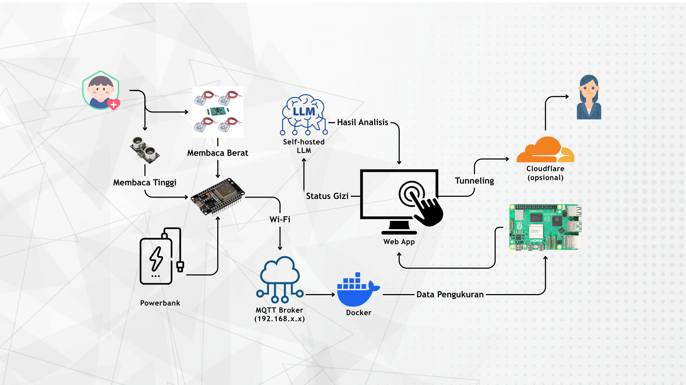

# Infrastruktur AIoT Sok!Anak



Sok!Anak merupakan platform kesehatan gizi anak berbasis data WHO yang ditujukan untuk posyandu, dengan fokus pada aspek privasi dan keamanan data. Arsitektur dan infrastruktur, yang meliputi kecerdasan buatan (AI), Internet of Things (IoT), dan aplikasi web, dijalankan secara lokal serta dikelola mandiri untuk mendukung kedaulatan data, tanpa mengirimkan data ke pihak eksternal. Aplikasi dan infrastruktur beroperasi sepenuhnya di lingkungan lokal. Untuk keperluan akses publik, tersedia opsi penggunaan Cloudflare Tunnel atau Headscale (bagi yang memilih pengelolaan secara mandiri).

## Persyaratan Hosting

**Rekomendasi:** Gunakan server fisik (misalnya Raspberry Pi atau server bekas) untuk mencapai kedaulatan digital penuh. Apabila memilih layanan hosting, gunakan Cloud Hosting (VPS) yang berlokasi di Indonesia. Penggunaan platform shared hosting berbasis PHP konvensional tidak disarankan, karena sistem memerlukan akses langsung ke protokol MQTT serta layanan sistem lainnya.

## Prasyarat Sistem

Sebelum memulai proses instalasi, pastikan prasyarat berikut telah terpenuhi.

### 1. Instalasi Docker Engine
Docker diperlukan untuk menjalankan layanan MQTT broker dan layanan AI secara mandiri (self-hosted). Jalankan perintah berikut untuk menginstal Docker Engine pada sistem Debian/Ubuntu:

```bash
wget https://github.com/ricalnet/digital-independence/blob/main/install-docker-engine-on-debian.sh
chmod +x install-docker-engine-on-debian.sh
./install-docker-engine-on-debian.sh
```

> Verifikasi dengan menjalankan `docker --version` dan `docker compose version`.

### 2. Pemeriksaan Konfigurasi Pra-Deployment

Sebelum memulai proses deployment, pastikan semua konfigurasi berikut telah disesuaikan.

#### a. Konfigurasi Database
**File:** `config/database.php`

Sesuaikan parameter berikut:
| Parameter | Keterangan |
|-----------|-------------|
| `host` | Alamat server database (umumnya `localhost`) |
| `database` | Nama database yang akan digunakan |
| `username` | Username database |
| `password` | Password database |
| `kecamatan_list` | Daftar kecamatan sesuai kebutuhan |
| `desa_list` | Daftar desa/kelurahan sesuai kebutuhan |

#### b. Sinkronisasi Konfigurasi Lainnya
Parameter `kecamatan_list` dan `desa_list` harus diselaraskan di **semua file berikut**:
- `config/database.php`
- `settings.php`
- `signup.php`
- `footer.js`

#### c. Konfigurasi Database Awal
**File:** `docs/db/start_db.sql`

Pastikan baris terakhir file ini (konfigurasi user database) disesuaikan dengan kredensial database yang digunakan.

#### d. Konfigurasi Direktori IoT
**File:** `iot/get_latest_height.php` dan `iot/get_latest_weight.php`

Sesuaikan perintah berikut:
```php
$command = 'mosquitto_sub -h [IP_ADDRESS] -t "iot/nama_sensor" -u [USERNAME] -P [PASSWORD] -C 1 -W 3 2>&1';
```

Ganti nilai dalam tanda kurung siku `[ ]` dengan nilai yang sesuai.

## Instalasi Dependensi

Jalankan perintah berikut untuk menginstal semua paket yang diperlukan:

```bash
sudo apt install -y nginx mariadb-server php-fpm php-mysql \
    php-mysqli php-pear php-phpseclib php-mbstring php-zip \
    php-gd php-curl php-common php-imagick php-gmp php-intl php-apcu
```

> **Alternatif:** Untuk menggunakan sertifikat self-signed, jalankan script berikut:
> ```bash
> ./install-web-server-and-ssl.sh
> ```

## Setup Database

1. Buka terminal MySQL:
   ```bash
   sudo mysql -u root -p
   ```

2. Salin seluruh isi file `docs/db/start_db.sql` dan tempelkan di terminal MySQL, lalu tekan Enter.

## Konfigurasi Nginx

1. Buka file konfigurasi Nginx:
   ```bash
   sudo nano /etc/nginx/sites-available/default
   ```

2. Ganti seluruh isi file dengan konfigurasi dari `docs/nginx-default`

3. Simpan file (Ctrl+O, Enter) dan keluar (Ctrl+X)

4. Uji konfigurasi Nginx:
   ```bash
   sudo nginx -t
   ```

5. Restart Nginx jika tidak ada error:
   ```bash
   sudo systemctl restart nginx
   ```

## Deployment Aplikasi

Jalankan perintah deployment:

```bash
./deploy.sh
```

> Pastikan script `deploy.sh` memiliki izin eksekusi:
> ```bash
> chmod +x deploy.sh
> ```

## Deployment Layanan AI Self-Hosted (Open WebUI)

Sok!Anak menyediakan layanan konsultasi AI yang berjalan secara lokal menggunakan Open WebUI. Layanan ini memastikan seluruh data konsultasi tetap berada di server.

### 1. Konfigurasi Environment
Salin file environment contoh dan sesuaikan konfigurasinya:

```bash
cp ai/.env.example ai/.env
nano ai/.env
```

Sesuaikan parameter yang diperlukan.

### 2. Menjalankan Layanan Open WebUI
Jalankan Docker Compose dari direktori `ai/`:

```bash
cd ai
docker compose up -d
cd ..
```

### 3. Verifikasi Layanan AI
Setelah container berjalan, akses antarmuka Open WebUI melalui browser:

```
http://localhost:3000
```

## Sinkronisasi Perangkat IoT

Untuk menghubungkan perangkat IoT dengan server, lakukan langkah-langkah berikut:

### 1. Konfigurasi Koneksi Server pada Aplikasi
Sesuaikan baris berikut di file-file terkait:

| File | Baris yang disesuaikan |
|------|----------------------|
| `iot/get_latest_height.php` | `$command = 'mosquitto_sub...'` |
| `iot/get_latest_weight.php` | `$command = 'mosquitto_sub...'` |

**Contoh konfigurasi lengkap:**
```php
$command = 'mosquitto_sub -h 192.168.0.50 -t "iot/sensor_tinggi" -u mqtt_user -P rahasia123 -C 1 -W 3 2>&1';
```

### 2. Flash Firmware Sensor

Sebelum melakukan flashing, pastikan konfigurasi pada kode sumber sensor telah disesuaikan.

#### a. Sesuaikan Konfigurasi Firmware
Edit file konfigurasi jaringan dan MQTT pada masing-masing sensor:

- **Sensor Berat (Load Cell HX711):** `sensors/hx711/src/main.cpp`
- **Sensor Tinggi (Ultrasonik):** `sensors/ultrasonic/src/main.cpp`

Parameter yang perlu disesuaikan mencakup SSID WiFi, password WiFi, alamat IP MQTT broker, username, password, dan topic MQTT.

#### b. Siapkan Environment dan Deploy
Jalankan perintah berikut untuk menginstal dependensi dan mem-flash firmware ke perangkat:

```bash
# Buat virtual environment Python
python3 -m venv venv

# Aktifkan virtual environment
source venv/bin/activate

# Instal PlatformIO
pip install platformio

# Jalankan script deployment
python3 deploy.py
```

Script `deploy.py` akan secara otomatis melakukan kompilasi dan mengunggah firmware ke mikrokontroler yang terhubung.

## Sumber Daya Tambahan

| Sumber Daya | Deskripsi | Lokasi / Tautan |
|-------------|-----------|-----------------|
| **Source Code Sensor (Firmware)** | Kode sumber untuk perangkat keras IoT | `sensors/` |
| **MQTT Broker (Docker)** | Dokumentasi menjalankan MQTT broker sendiri menggunakan Docker | `iot/mqtt-docker/README.md` |
| **Open WebUI (AI Self-Hosted)** | Konfigurasi dan environment AI | `ai/.env` |
| **Pendaftaran Pengguna** | Atur status pendaftaran di file `signup.php`. Set ke `true` untuk membuka pendaftaran, atau `false` untuk menutup pendaftaran. | `signup.php` |

## Verifikasi Setelah Deployment

| Komponen | Metode Verifikasi |
|----------|-------------------|
| Web Server | Akses domain/IP melalui browser |
| Database | Login ke aplikasi, periksa koneksi |
| MQTT | Periksa log pada direktori `iot/` |
| AI Self-Hosted | Akses `http://localhost:3000` melalui browser |
| SSL (jika digunakan) | Periksa ikon kunci di browser |