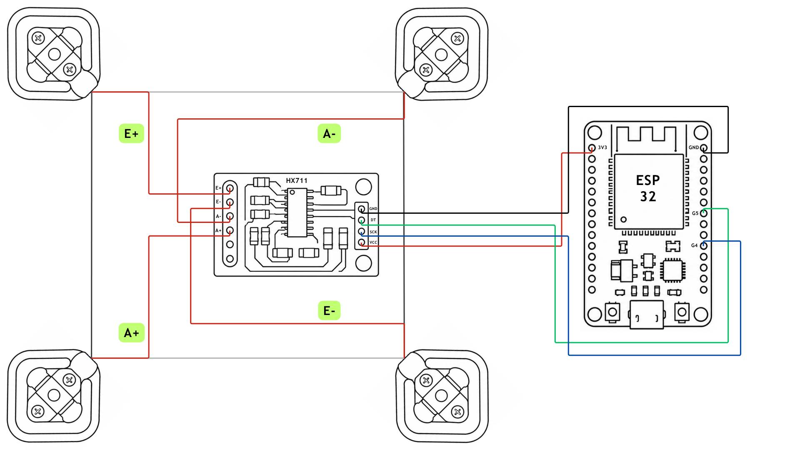

# Sistem Timbangan Digital Berbasis ESP32 dengan HX711

## 1. Spesifikasi Teknis dan Prosedur Perakitan Perangkat Keras

### 1.1 Verifikasi Integritas Load Cell
Sebelum proses integrasi, lakukan verifikasi kelayakan setiap unit load cell. Setiap unit harus memiliki tiga kabel terintegrasi (standar: Merah, Hitam, Putih).

**Prosedur Pengukuran dengan Multimeter:**
1.  Kabel Hitam (probe Hitam) dan Kabel Putih (probe Merah): ~2 kΩ.
2.  Kabel Putih (probe Hitam) dan Kabel Merah (probe Merah): ~1 kΩ.
3.  Kabel Hitam (probe Hitam) dan Kabel Merah (probe Merah): ~1 kΩ.

### 1.2 Konfigurasi Multi-Load Cell
Menggunakan empat load cell dalam konfigurasi Jembatan Wheatstone penuh.
- **Kapasitas per Unit:** 50 kg
- **Kapasitas Maksimum Sistem:** 200 kg (~440 lb)

### 1.3 Diagram Interkoneksi dan Alokasi Pin

Koneksikan load cell ke HX711 sesuai skematik berikut.


*Gambar 1: Skema interkoneksi modul HX711 dengan konfigurasi empat load cell.*

| Terminal Load Cell | Terminal HX711 |
| :----------------- | :------------- |
| E+                 | E+             |
| E-                 | E-             |
| A+                 | A+             |
| A-                 | A-             |

| Pin HX711 | Pin ESP32 | Fungsi           |
| :-------- | :-------- | :--------------- |
| DT        | GPIO4     | Serial Data      |
| SCK       | GPIO5     | Serial Clock     |
| VCC       | 3.3V      | Catu Daya        |
| GND       | GND       | Ground Bersama   |

**Catatan:** Alokasi pin dapat diubah pada variabel `HX711_dout` dan `HX711_sck` jika diperlukan. Kode menerapkan `setReverseOutput()` untuk menyesuaikan polaritas pembacaan.

## 2. Prosedur Deployment Firmware

Unggah firmware ke ESP32 menggunakan skrip `deploy.py`.

```bash
python3 deploy.py
```

Firmware akan menginisialisasi load cell dengan waktu stabilisasi 2 detik. Jika terjadi timeout, periksa koneksi. Faktor kalibrasi dari EEPROM dimuat otomatis; jika tidak valid, sistem akan langsung masuk ke mode kalibrasi.

## 3. Prosedur Kalibrasi dan Operasi

Sistem menyediakan tiga perintah utama melalui Serial Monitor (baud rate 115200 bps).

### 3.1 Memulai Monitor Serial
```bash
pio device monitor -b 115200
```

### 3.2 Referensi Perintah Serial

| Perintah | Fungsi | Detail |
| :------- | :----- | :----- |
| **`t`** | **Tare (Zeroing)** | Mereset pembacaan ke nol. Gunakan saat timbangan kosong untuk mengeliminasi offset. |
| **`r`** | **Kalibrasi** | Memulai rutin kalibrasi terpandu (langkah detail di bawah). |
| **`c`** | **Ubah Faktor Manual** | Mengganti faktor kalibrasi dengan memasukkan nilai numerik secara langsung, tanpa beban fisik. |

### 3.3 Prosedur Kalibrasi Penuh (Perintah `r`)

1.  Kirim perintah `r`. Sistem akan menampilkan: `"=== CALIBRATION START ==="` dan meminta Anda menghapus semua beban.
2.  Kirim perintah `t` untuk melakukan tare. Tunggu hingga sistem menampilkan `"Tare complete"`.
3.  Sistem akan meminta: `"Place known mass (GRAM) and send value:"`.
4.  Letakkan beban dengan massa yang diketahui secara pasti (contoh: 5000 untuk 5 kg) di atas timbangan.
5.  Masukkan nilai massa dalam **satuan gram** melalui Serial Monitor dan tekan Enter.
6.  Sistem akan menghitung faktor kalibrasi baru dan menampilkannya. Ketik `y` untuk menyimpan ke EEPROM, atau `n` untuk membatalkan.

### 3.4 Prosedur Mengubah Faktor Kalibrasi Manual (Perintah `c`)

1.  Kirim perintah `c`. Sistem menampilkan faktor saat ini.
2.  Masukkan nilai faktor kalibrasi baru yang diinginkan.
3.  Konfirmasi penyimpanan dengan `y` (simpan) atau `n` (batal).

## 4. Fitur Publikasi MQTT

Sistem akan otomatis terhubung ke broker MQTT dan mempublikasikan data berat ke topik **`iot/hx711`** setiap 2 detik dalam format string dengan dua desimal (misal: `"1.25"` untuk 1,25 kg). Konfigurasi kredensial WiFi dan MQTT dilakukan pada variabel di dalam kode sumber.